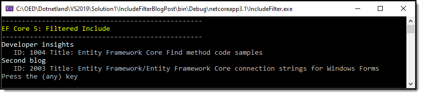
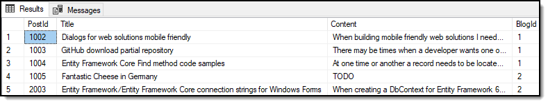

# About

Entity Framework Core 5 [Filtered Include](https://docs.microsoft.com/en-us/ef/core/what-is-new/ef-core-5.0/whatsnew#filtered-include)

> Uses the same exact code that Microsoft uses but here there is a script for the database to try out the filtered include.

